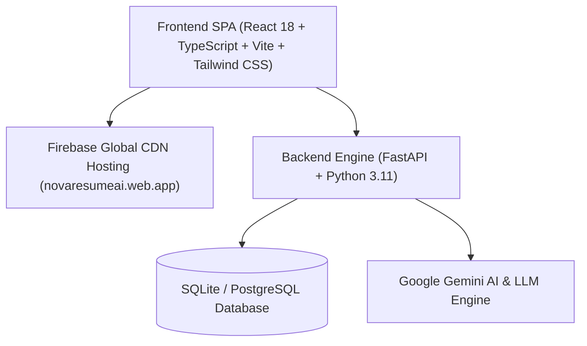

# NovaResume AI 🚀
### Enterprise AI-Powered Resume Builder, ATS Score Analyzer & Career Platform

[](https://novaresumeai.web.app/)
[](https://github.com/DhobiVed)
[](LICENSE)
[](https://novaresumeai.web.app/)

> **Live Production Website:** [https://novaresumeai.web.app](https://novaresumeai.web.app)

---

## 👨‍💻 Founder & Ownership

| Platform Ownership | Details |
| :--- | :--- |
| **Founder & Lead Developer** | **Mr. Ved Dhobi** |
| **GitHub Profile** | [@DhobiVed](https://github.com/DhobiVed) |
| **Repository** | [DhobiVed/NovaResume-AI](https://github.com/DhobiVed/NovaResume-AI) |
| **Official Deployment** | [https://novaresumeai.web.app](https://novaresumeai.web.app) |

---

## 🌟 Overview

**NovaResume AI** is an end-to-end, enterprise-grade career advancement platform founded and created by **Mr. Ved Dhobi**. Designed to empower students, software engineers, and professionals, it provides automated ATS resume audits, strict 50-MCQ language certifications, personalized web portfolio creation, and seamless multi-role campus-to-industry hiring pipelines.

---

## ✨ Core Platform Capabilities

### 1. 📄 AI-Powered ATS Resume Builder
- **Handcrafted Industry Templates:** Modern, Executive, Minimalist, and Creative designs formatted specifically to pass applicant tracking systems.
- **Real-Time ATS Score Audit:** Instantly scores resume content against target Job Descriptions (JD) and flags missing high-value technical keywords.
- **1-Click AI Bullet Polishing:** Transforms weak descriptions into impactful, metric-driven achievement statements using industry action verbs.

### 2. 🎓 50-MCQ Programming Certification Engine
- **Independent Topic Isolation:** 10 discrete domain tracks (Python, JavaScript, TypeScript, C++, Java, Rust, Go, SQL, HTML/CSS, Assembly).
- **Zero Cross-Pollination:** Questions are strictly validated and classified to ensure zero topic leakage across distinct language exams.
- **Proctoring Suite:** Integrated fullscreen monitoring, tab-switch detection, and automated score certification.

### 3. 🌐 Instant AI Web Portfolio Generator
- Generates fully responsive, stand-alone personal developer portfolios in seconds.
- Exports custom portfolio code with projects, live demo links, skill graphs, and contact integration.

### 4. 💼 CareerConnect Multi-Role Ecosystem (SIH 26044)
- **Student Hub:** Take assessments, earn badges, track applications, and view recommended jobs.
- **Recruiter Portal:** Post job requirements, filter candidates by verified test scores, and invite talent.
- **Faculty Portal:** Review student performance, publish departmental challenges, and track placements.
- **Institution Portal:** University-wide analytics, placement statistics, and accreditation reports.

---

## 🛠️ Architecture & Tech Stack



- **Frontend:** React 18, TypeScript, Tailwind CSS, Lucide Icons, Vite
- **Backend:** FastAPI, Python 3.11, Pydantic, SQLAlchemy, Uvicorn
- **AI & Scoring:** Google Gemini API, Custom Algorithmic ATS Scorer, Isolation Classifier
- **Cloud & Deployment:** Firebase Hosting, Firebase Firestore / Storage

---

## 🚀 Quickstart & Local Setup

### 1. Clone the Repository
```bash
git clone https://github.com/DhobiVed/NovaResume-AI.git
cd NovaResume-AI
```

### 2. Frontend Setup
```bash
cd frontend
npm install
npm run dev
```
Open `http://localhost:5173` in your browser.

### 3. Backend Setup
```bash
cd backend
python -m venv venv
# Windows:
venv\Scripts\activate
# Linux/macOS:
source venv/bin/activate

pip install -r requirements.txt
uvicorn app.main:app --reload --port 8000
```
Backend API interactive documentation available at `http://localhost:8000/docs`.

---

## 📄 License & Copyright

Copyright © 2026 **Mr. Ved Dhobi**. All rights reserved.  
Released under the [MIT License](LICENSE).
